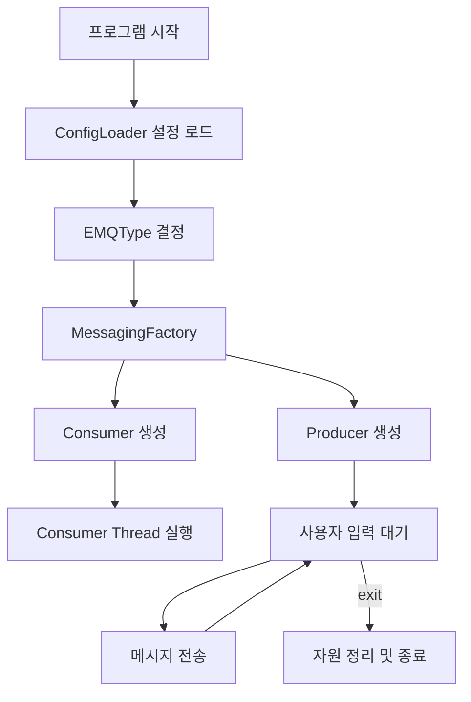
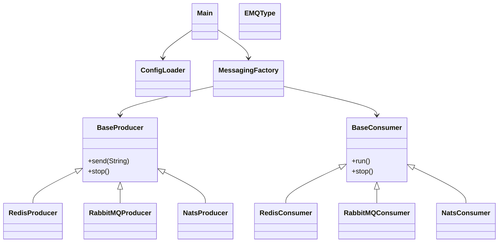

# Queue Messaging System (Java)

이 프로젝트는 **Redis / RabbitMQ / NATS** 를 동일한 인터페이스로 다룰 수 있도록 설계된 **메시징 큐 추상화 예제**입니다.
설정 파일(`config.properties`)의 값에 따라 런타임에 사용할 메시징 시스템이 결정됩니다.

---

## 1. 프로젝트 목표

* 메시징 시스템 교체 시 **비즈니스 로직 수정 최소화**
* Producer / Consumer 공통 로직의 **재사용성 향상**
* 유지보수와 확장에 유리한 구조 (OCP 지향)

---

## 2. 전체 구조 개요

* `Main` : 프로그램 진입점
* `ConfigLoader` : 설정 파일 로드
* `EMQType` : 메시징 큐 타입 열거형
* `MessagingFactory` : 타입에 맞는 Producer / Consumer 생성
* `BaseProducer`, `BaseConsumer` : 공통 추상 클래스
* `Redis / RabbitMQ / NATS` 구현체

---

## 3. 실행 흐름 (Flow)

---

## 4. 클래스 다이어그램

---

## 5. Factory 패턴 적용 이유

`MessagingFactory`를 통해 객체 생성을 캡슐화함으로써:

* `Main` 은 **구현 클래스에 의존하지 않음**
* 새로운 메시징 시스템 추가 시

  * `EMQType` 추가
  * Producer / Consumer 구현 추가
  * Factory만 수정

👉 기존 로직 변경 없이 확장 가능

---

## 6. 유지보수 관점에서의 장점

* 공통 기능은 `BaseProducer / BaseConsumer` 에 집중
* 설정 기반 동작 → 환경별 배포 용이
* 테스트 시 Mock Producer / Consumer 추가 가능

---

## 7. 개선해볼 수 있는 포인트

* `ExecutorService` 생명주기 관리 책임 분리
* 인터페이스(`Producer`, `Consumer`)와 추상 클래스 역할 분리
* 예외 처리 전략 통합 (재시도, DLQ 등)

---

## 8. 실행 방법

1. `config.properties` 설정
2. `Main` 실행
3. 콘솔에 메시지 입력
4. `exit` 입력 시 종료

---

## 9. Mermaid 사용 팁

* GitHub, GitLab, Obsidian, VS Code Markdown Preview에서 바로 렌더링 가능
* 온라인 편집기: Mermaid Live Editor 활용 가능

---

> 이 문서는 **발표용 / README 용도로 바로 사용 가능**하도록 작성되었습니다.
